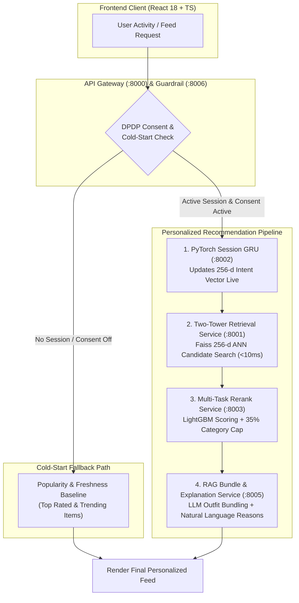
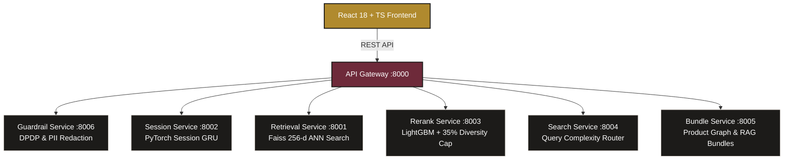

# NowCart — Real-Time Personalized Discovery & Recommendation Engine

**NowCart** is an end-to-end, real-time personalized recommendation and discovery microservices platform built for modern e-commerce. It features multi-modal product embeddings, PyTorch session intent GRU models, LightGBM multi-task reranking with diversity caps, DPDP-compliant guardrails, and RAG outfit bundle generation.

---

## 🚀 Key Features

*   **⚡ Low Latency Candidates Retrieval**: Multi-modal 256-d product vectors indexed with **Faiss** ANN search ($< 10\text{ms}$ latency).
*   **🧠 Real-Time Session Intent Tracking**: Sequential PyTorch **GRU neural network** updating intent vectors live on every clickstream event (`view`, `click`, `cart`, `purchase`).
*   **📊 LightGBM Reranking & 35% Diversity Cap**: Multi-task candidate scoring with a deterministic post-processing guardrail strictly enforcing that no single product category exceeds **35%** of returned feed items.
*   **🔍 Query Complexity-Based Semantic Search**: Cost-aware query router that bypasses expensive LLM calls for simple queries ($\le 3$ words), logging routing paths and token costs.
*   **👗 RAG Outfit Bundles ("Complete the Look")**: Graph-backed complementary item retrieval paired with a single-prompt LLM generating natural-language styling explanations.
*   **🛡️ DPDP Data Protection & Guardrail Layer**: Data minimization checks, PII redaction (email/phone scrubbing in queries), consent overrides, rule-based explainability reasons, and compliance audit logging.
*   **🎨 React 18 + TypeScript + Tailwind UI**: Polished e-commerce store with an interactive Session Intent Simulator, Cold-Start mode toggle, and live microservices health drawer.

---

## 📐 System Architecture & Recommendation Pipeline

NowCart consists of 8 modular microservices orchestrated via an API Gateway, powering real-time personalization, vector discovery, and privacy guardrails.

### 1. Recommendation Pipeline & Cold-Start Fallback Flow



### 2. Microservices Architecture Topology



For the complete end-to-end Mermaid sequence diagram, refer to **[docs/architecture.md](file:///c:/Users/akhim/Downloads/Telegram%20Desktop/NowCart/docs/architecture.md)**.

---

## 🛠️ Quick Start & Running locally

### Prerequisites
- [Docker](https://www.docker.com/) & Docker Compose
- Python 3.10+ (for local development/notebooks)

### Spin up the Full Stack with One Command:

```bash
docker-compose up --build
```

This starts all 8 services and the React frontend:

| Component | Port / URL | Description |
| :--- | :--- | :--- |
| **Frontend UI** | `http://localhost:5173` | React + TypeScript Store & Session Simulator |
| **API Gateway** | `http://localhost:8000` | Unified REST Single Entrypoint |
| **Retrieval Service** | `http://localhost:8001` | Faiss ANN Candidate Retrieval |
| **Session Service** | `http://localhost:8002` | Session Intent Tracking GRU |
| **Rerank Service** | `http://localhost:8003` | LightGBM Scoring & Diversity Guardrail |
| **Search Service** | `http://localhost:8004` | Semantic Search & Complexity Router |
| **Bundle Service** | `http://localhost:8005` | "Complete the Look" RAG Outfit Bundles |
| **Guardrail Service** | `http://localhost:8006` | PII Scrubbing, Consent & DPDP Audit Logs |

---

## 🧪 Running Benchmarks & Integration Tests

### Run API Gateway & Stack Latency Benchmark:
```bash
python benchmark_stack.py
```

### Run Service Unit & Integration Tests:
```bash
# Guardrail & DPDP Compliance Integration Tests
python backend/services/guardrail_service/test_guardrail.py

# Reranker Diversity Cap Unit Test
python backend/services/rerank_service/test_rerank.py
```

---

## 📚 Documentation Links

- **[System Architecture & Sequence Diagram](file:///c:/Users/akhim/Downloads/Telegram%20Desktop/NowCart/docs/architecture.md)** — Detailed Mermaid workflow from clickstream events to frontend presentation.
- **[Cost Per Inference & Production Scale Roadmap](file:///c:/Users/akhim/Downloads/Telegram%20Desktop/NowCart/docs/cost_per_inference.md)** — Itemized latency benchmarks, token cost breakdowns, and 10k RPS scaling plan.
- **[DPDP Compliance Framework](file:///c:/Users/akhim/Downloads/Telegram%20Desktop/NowCart/docs/dpdp_compliance.md)** — Analysis of data minimization, consent, PII redaction, and explainability under DPDP.
- **[8-Minute Live Demo Presentation Walkthrough](file:///c:/Users/akhim/Downloads/Telegram%20Desktop/NowCart/docs/demo_script.md)** — Step-by-step presentation script covering home feed, session simulator, search, and architecture.
- **[Executive Business Pitch & ROI Framework](file:///c:/Users/akhim/Downloads/Telegram%20Desktop/NowCart/docs/business_pitch.md)** — Business value metrics (+25% CTR, +15% Add-to-Cart), cost breakdown, and roadmap.
