# NowCart System Architecture

This document provides a comprehensive overview of the **NowCart** real-time recommendation, semantic search, and RAG discovery engine architecture.

---

## 📐 End-to-End Request Flow Diagram

Below is the complete request sequence diagram illustrating how clickstream events, user context, vector retrieval, reranking, and guardrail compliance flow from the frontend through backend microservices.

```mermaid
sequenceDiagram
    autonumber
    actor User as Frontend Client (React UI)
    participant GW as API Gateway (:8000)
    participant GR as Guardrail Service (:8006)
    participant SS as Session Service (:8002)
    participant RS as Retrieval Service (:8001)
    participant RK as Rerank Service (:8003)
    participant BS as Bundle Service (:8005)
    participant SCH as Search Service (:8004)

    %% Scenario 1: Clickstream Event Ingestion
    rect rgb(15, 23, 42)
    note right of User: 1. Clickstream Event Ingestion
    User->>GW: POST /events {user_id, product_id, event_type}
    GW->>SS: POST /session/events
    SS-->>GW: Event Ingested (GRU History Updated)
    GW-->>User: HTTP 200 Accepted
    end

    %% Scenario 2: Personalized Home Feed Recommendation
    rect rgb(13, 148, 136)
    note right of User: 2. Personalized Feed Generation
    User->>GW: GET /feed/{user_id}?consent=true
    GW->>GR: POST /preprocess (Check Consent & PII)
    GR-->>GW: Preprocess OK (allow_personalization=True)
    GW->>SS: GET /session/intent-vector/{user_id}
    SS-->>GW: 256-d Intent Vector (PyTorch GRU)
    GW->>RS: POST /retrieve {query_vector}
    RS-->>GW: Top Candidates (Faiss ANN Search)
    GW->>RK: POST /rerank {candidates, context}
    RK-->>GW: Ranked Items (LightGBM + 35% Diversity Cap)
    GW->>GR: POST /postprocess {results}
    GR-->>GW: Compliance Verified (Rules-based reasons appended)
    GW-->>User: HTTP 200 {results, correlation_id}
    end

    %% Scenario 3: Semantic Search Flow
    rect rgb(30, 41, 59)
    note right of User: 3. Semantic Search Flow
    User->>GW: POST /search {query: "black dress"}
    GW->>GR: POST /preprocess (Redact PII in query)
    GR-->>GW: Cleansed Query ("black dress")
    GW->>SCH: POST /search {query}
    SCH->>SCH: Query Complexity Router (cheap_rule_based vs LLM)
    SCH->>RS: Vector Search Candidates
    SCH->>RK: Rerank Candidates
    SCH-->>GW: Search Results
    GW->>GR: POST /postprocess
    GR-->>GW: Audited Results
    GW-->>User: HTTP 200 {results, route_used, cost}
    end

    %% Scenario 4: "Complete the Look" RAG Outfit Bundle
    rect rgb(30, 58, 138)
    note right of User: 4. RAG Outfit Bundle Generation
    User->>GW: GET /bundle/{product_id}
    GW->>BS: POST /bundle/{product_id}
    BS->>BS: Query Product Graph (Amazon/H&M Co-purchase Edges)
    BS->>BS: RAG LLM Selection (Select 3-4 items & write explanation)
    BS-->>GW: Bundle Payload {items, explanation}
    GW-->>User: HTTP 200 {bundle_items, explanation}
    end
```

---

## 🧩 Component Architecture Summary

1. **API Gateway (`backend/api_gateway`)**:
   - Single entrypoint routing client requests to downstream microservices.
   - Enforces 2.0s HTTP timeouts, graceful fallbacks, and distributes `X-Correlation-ID` headers.

2. **Embedding & Vector Search (`ml/embeddings` & `backend/services/retrieval_service`)**:
   - Encodes titles/descriptions into 256-d vectors via `sentence-transformers/all-MiniLM-L6-v2`.
   - Index flat IP cosine similarity search using Faiss.

3. **Session Intent Tracking (`ml/session_model` & `backend/services/session_service`)**:
   - PyTorch `SessionIntentGRU` neural network updating real-time user intent vectors on every clickstream event (`view`, `click`, `cart`, `purchase`).

4. **Multi-Task Scoring & Diversity Guardrail (`backend/services/rerank_service`)**:
   - LightGBM binary classifier scoring candidates on popularity, price, category matches, and freshness.
   - Enforces a **35% maximum category cap** per recommendation list via deterministic greedy re-insertion.

5. **Semantic Search (`backend/services/search_service`)**:
   - Cost-aware complexity router. Bypasses LLM pipelines for simple queries ($\le 3$ words), saving token costs.

6. **RAG Outfit Bundles (`backend/services/bundle_service`)**:
   - Product Graph mapping item complementary pairs.
   - Single-prompt RAG LLM selecting 3–4 candidates and generating styling descriptions.

7. **DPDP Compliance & Guardrails (`backend/services/guardrail_service`)**:
   - Blocks raw PII keys (`400 Bad Request`), scrubs PII in search queries, overrides non-consenting users to popularity feeds, and appends audit logs to `data/processed/guardrail_audit.log`.
